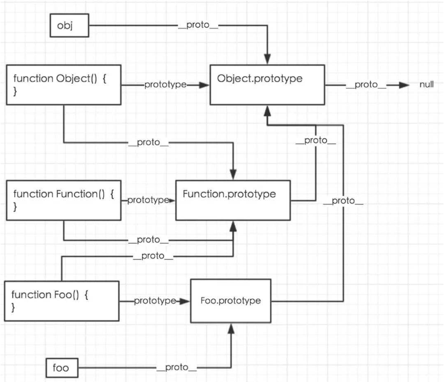
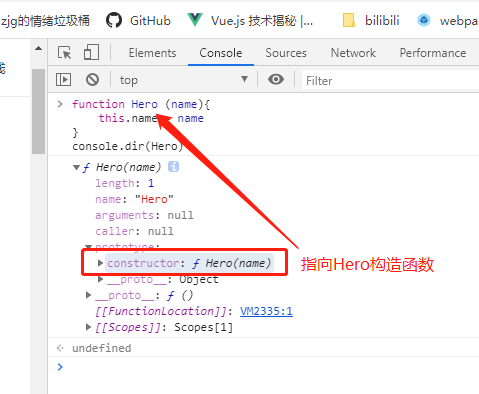
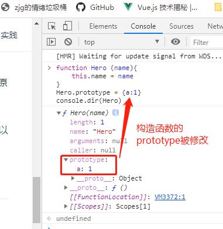
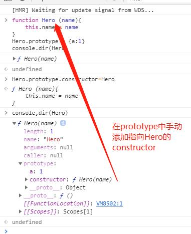
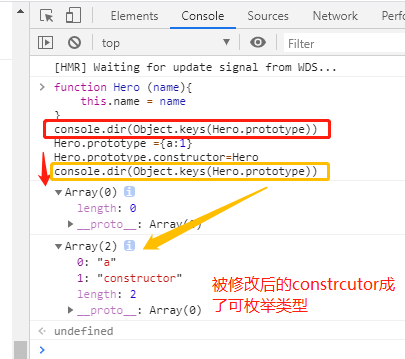
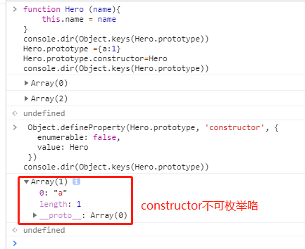
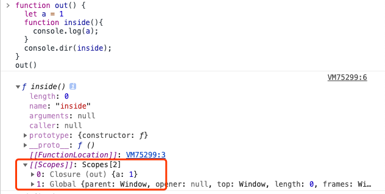
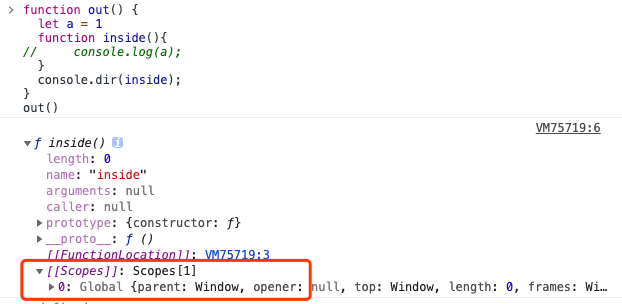
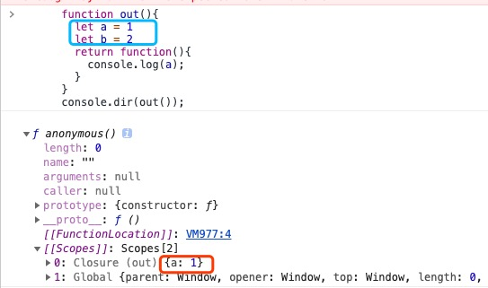

# javascript

## 原型

javascript 在设计继承机制的时候没有选择引入 class 类的概念（es6 引入了 class 关键字，本质还是构造函数的语法糖），主要是依靠 new 后面跟构造函数的方式来生成实例对象的。

举个栗子

```js
function Hero(name) {
  // this就指向了实例对象
  this.name = name;
}
let timo = new Hero("提莫");
console.log(timo.name); // 提莫
```

### new 操作符

如何实现一个 new 操作符,首先知道 new 做了什么

1. 首先创建一个空的对象，空对象的**proto**属性指向构造函数的原型对象,其实就是构造函数的 this 指向实例
2. 把上面创建的空对象赋值构造函数内部的 this，用构造函数内部的方法修改空对象
3. 如果构造函数返回一个非基本类型的值，则返回这个值，否则上面创建的对象

```js
// new的简单实现
function _new(fn, ...arg) {
  const obj = Object.create(fn.prototype);
  const ret = fn.apply(obj, arg);
  return ret instanceof Object ? ret : obj;
}
```

::: tip
用构造函数生成实例对象，有一个缺点，那就是无法共享属性和方法。
:::

### prototype

于是 javascript 引入了 protrotype 属性，所有实例对象需要共享的属性和方法，都放在这个构造函数的 prototype 中。举个栗子：

```js
function Hero(name) {
  // this就指向了实例对象
  this.name = name;
}
Hero.prototype.skill = function() {
  console.log(`${this.name}的技能`);
};
let timo = new Hero("提莫");
let noc = new Hero("魔腾");
timo.skill(); // 提莫的技能
noc.skill(); // 魔腾的技能
```

把 skill 方法放在 hero 的原型对象上后，所有生成的实例都可以共享；当我修改 prototype 的属性时，也会影响所有的实例对象，达到了继承的目的

### 原型链

当调用某种方法或查找某种属性时，首先会在自身调用和查找，如果自身并没有该属性或方法，则会去它的**proto**属性中调用查找，这个**proto**指向了它的构造函数的 prototype，这一寻找过程形成的查找链就是原型链。

老规矩上图(百度来的 选了一个比较清楚的)：



这里有两个比较特殊的地方：

1. 构造函数 Function 的 prototype 和**proto**都指向 Function.prototype(因为 Function 也是 Function 构造的 ^-^)
2. Object.prototype 最终指向 null，也就是所有的原型链都是以 null 为终点

### instanceof & constructor

#### constructor

在 js 中创建的每个函数都会有一个 prototype（原型）对象，这个原型对象上会有一个 constructor 属性，这个属性默认情况下指向构造函数。



但当我们将构造函数的 prototype 指向一个的新的对象时，constructor 属性就不再指向 Hero。
因为会把构造函数默认的 prototype 被新对象覆盖，那么指向构造函数的 constructor 就不复存在。



如果我们对 Hero.prototype 重新赋值后希望 constructor 仍指向 Hero 的话，可以手动添加一个 constructor 属性让它指向 Hero



虽然 constructor 重新指向 Hero，但同时我们也发现 constructor 变成了可枚举属性，constructor 属性默认是不可枚举的，即[[Enumerable]]的值为 false



没事！困难总比办法多(:smirk: :smirk:)

```js
Object.defineProperty(Hero.prototype, "constructor", {
  enumerable: false,
  value: Hero,
});
```



#### instanceof

instanceof 运算符用来测试一个对象在其原型链中是否存在一个构造函数的 prototype 属性
instanceof 不仅可以判断实例对象直接的构造函数，而且还能判断原型链上所有的构造函数，上面代码中 Object 在 person 的原型链中，所以返回 true。
可见 Person.prototype 对象被重写并不影响 instanceof 的判断，因为 instanceof 是根据原型链来判断构造函数的，只要对象实例的原型链不发生变化，instanceof 便可以正确判断

## 作用域&闭包

### 作用域

在我的理解中作用域就是变量访问的规则

举个栗子

```js
function out() {
  var a = 123;
  console.log(a); // 123
}
outFun2();
console.log(a); // a is not defined
```

上面的例子可以体现作用域的意义，变量 a 在 out 函数中声明，所以在全局作用域下取值会报错

> JavaScript 分为局部作用域和全局作用域（还有"块级作用域"，后面会说）

- 变量在函数内声明为局部作用域，只能被当前作用域和内层的作用域访问；
- 变量在全局声明则为全局作用域，能被任何地方访问；

js 中变量的访问规则：内层作用域可以访问外层作用域的变量，反之不行；
也就是说如果函数嵌套了函数，在最内部函数中访问某个变量时，会一层层往外访问声明的变量，层层访问就形成了作用域链；

var 声明赋值的变量会在当前的作用域内预解析导致变量提升，当执行到赋值语句再赋值

举个栗子

```js
function out() {
  console.log(a); // undefined
  var a = 123;
  console.log(a); // 123
}
outFun2();
```

所有末定义直接赋值的变量自动声明为拥有全局作用域

```js
function out() {
  a = 123;
}
outFun2();
console.log(a); // 123
```

原因也很简单，执行函数给 a 赋值时，会在作用域链上找定义 a 的作用域，一直访问到全局，也没有定义 a，于是 a 被定义在了 window 全局对象上，当我们访问 a 时就是访问的 window.a

我们现在知道函数会创建一个的作用域,但是块语句(if 条件语句或 for 循环语句)不像函数，它们不会创建一个新的作用域。在块语句中定义的变量将保留在它们已经存在的作用域中。
这里就会引申出一个经典的面试题

```js
var a = [];
for (var i = 0; i < 10; i++) {
  a[i] = function() {
    console.log(i);
  };
}
a[1](); // 10
```

这就是上面所说的,在块语句中定义的变量将保留在它们已经存在的作用域中,当我们调用 a[1]的时候 这个 i 其实就是最初在 for 中定义的 i,此时 for 循环执行完,i 已经是 10 了

怎么解决这个问题呢 我们可以通过自调用函数传参数的方式创建 10 个函数,形成自己的作用域,就不会访问到最外层 for 循环定的的 i 变量了

```js
var a = [];
for (var i = 0; i < 10; i++) {
  (function(i) {
    a[i] = function() {
      console.log(i);
    };
  })(i);
}
a[1](); // 1
```

说到这里,我们就可以引出"块级作用域"的概念了

> 块级作用域可通过在函数或者块语句(包括 if,for)用 es6 的 let 和 const 来声明形成

let const 将变量的作用域限制在当前代码块中。块级作用域有以下几个特点：

- 声明的变量不会提升到代码块顶部(变量提升)
- 禁止重复声明相同的变量名

改造一下初始的 for 循环代码 将 var 换成 let 就能解决问题,每次循环 let 都会产生块级作用域,维护自身 i 的变量,防止污染

```js
var a = [];
for (let i = 0; i < 10; i++) {
  a[i] = function() {
    console.log(i);
  };
}
a[1](); // 1
```

### 作用域与执行上下文

许多人混淆作用域和执行上下文的概念，误认为它们是相同的概念，但其实并不是。
JavaScript 属于解释型语言，JavaScript 的执行分为：解释和执行两个阶段,这两个阶段所做的事并不一样：

1. 解释阶段：

   - 词法分析
   - 语法分析
   - 作用域规则确定

2. 执行阶段：

   - 创建执行上下文
   - 执行函数代码
   - 垃圾回收

> JavaScript 解释阶段便会确定作用域规则，因此作用域在函数定义时就已经确定了，而不是在函数调用时确定，但是执行上下文是函数执行之前创建的。执行上下文最明显的就是 this 的指向是执行时确定的。而作用域访问的变量是编写代码的结构确定的。

作用域和执行上下文之间最大的区别是：
执行上下文在运行时确定，随时可能改变；作用域在定义时就确定，并且不会改变。
一个作用域下可能包含若干个上下文环境。有可能从来没有过上下文环境（函数从来就没有被调用过,同一个作用域下，不同的调用会产生不同的执行上下文环境。

### 闭包

对于闭包的定义有许多不同说法:

- MDN:函数和对其周围状态（lexical environment，词法环境）的引用捆绑在一起构成闭包（closure）。也就是说，闭包可以让你从内部函数访问外部函数作用域。在 JavaScript 中，每当函数被创建，就会在函数生成时生成闭包。

- 《javaScript 高级教程》中概念: 闭包是指有权访问另一个函数作用域中的变量的函数。

- 任何一个函数都是闭包 (忘了在哪看的了)

  首先定义一个 out 的外层函数,out 中定义 a 为 1,再定义一个 inside 内部函数,去访问 a,运行 out,输出 inside 对象,上图

  

  发现 inside 对象中有[[Scopes]]数组,其中有两个对象

  1. Closure: 包含了 out 函数中的活动对象
  2. Global: 全局对象

  当我们把 inside 函数里的 console.log 注释,也就是不访问 out 中定义的 a 时,我们再来运行
  

  发现[[Scopes]]数组中只剩一个 Global 对象了,也就是说只有内部访问了外层函数的变量,才会把外层函数的活动对象作为闭包放在[Scopes]]中,

  再给你们放上一张图  
  
  看了这个,不难猜到,虽然定义了 a,b,但是只有 a 被存在了闭包中,也就是说,只有被访问过的变量才会被保存起来的

  到这儿基本上都对闭包也有一定的理解了吧,对于一开始的闭包定义,我更倾向于 mdn 的说法
  虽然从理论的角度将,js 中所有函数都是闭包,但是从应用的角度来说,只有当函数以返回值返回、或者当函数以参数形式使用、或者当函数中的变量在函数外被引用时,闭包才有意义。

  闭包很强大,用途之一是实现对象的私有数据。在 vue 中,对 data 数据做响应式时,就是把观察者对象存在了 get 的闭包函数中
  但是滥用闭包,会导致内存无法被回收（参考浏览器的垃圾回收机制，后面有时间会补充进来的）,可以通过将引用的函数变量名复制为 null 手动清除;

## JS 的单线程

作为浏览器的脚本语言，JavaScript 在设计之初就是单线程,为什么不是多线程提高效率呢？

举个栗子：假定 JavaScript 同时有两个线程，一个线程在某个 DOM 节点上添加内容，另一个线程删除了这个节点，那么就会浏览器根据那条线程判断呢？
为了避免复杂性，js 就被设计成了单线程（之后浏览器为了利用多核 CPU 的计算能力，HTML5 提出 Web Worker 标准，允许 JavaScript 脚本创建多个线程，但是子线程完全受主线程控制，且不得操作 DOM。所以并没有改变 JavaScript 引擎单线程的本质）。

浏览器耗时任务开辟了另外的线程：

- 渲染引擎线程：顾名思义，该线程负责页面的渲染
- JS 引擎线程：负责 JS 的解析和执行
- 定时触发器线程：处理定时事件，比如 setTimeout, setInterval
- 事件触发线程：处理 DOM 事件（click）
- 异步 http 请求线程：处理 http 请求

虽然 JavaScript 是单线程的，可是浏览器内部不是单线程的。一些 I/O 操作、定时器的计时和事件监听等都是由浏览器提供的其他线程来完成的。这些线程都会排列在主线程之外的任务队列，等待被执行，这就是异步的概念。

