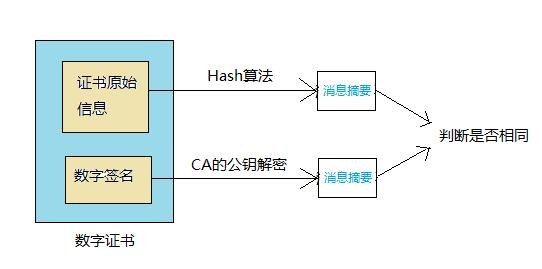
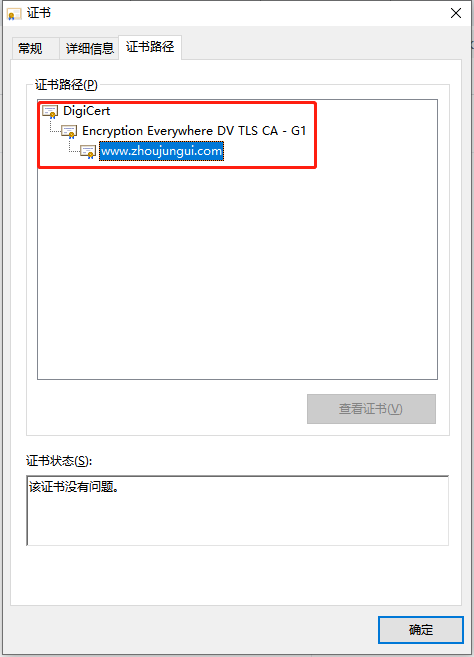
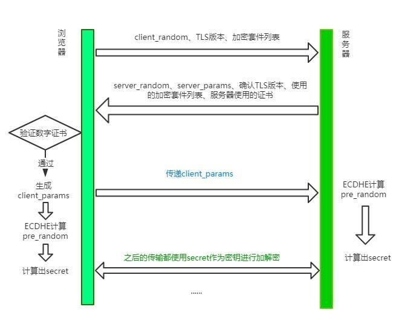

# network

## Http 协议

特点

1. 灵活：HTTP 允许传输任意类型的数据对象。体现传输的形式多样性。

2. 无状态：每次连接都是独立无关的，默认不需要保留状态信息。

3. 无连接：每次连接只处理一个请求。服务器处理完客户的请求，并收到客户的应答后，即断开连接。

### http 报文结构

http1.1 的报文结构由四部分构成

- 起始行/状态行 + 头部 + 空行 + 实体

#### 起始行/状态行

请求报文的起始行由请求方法 + 路径 + http 版本

> GET /home HTTP/1.1

响应报文的起始行由 http 版本、状态码和描述

> HTTP/1.1 200 OK

#### 请求头/响应头

头部中包含许多字段,客户端和服务器根据这些字段来做各种处理
例如:
Content-Encoding 指定 gzip 压缩
Content-Type 指定内容的格式
Cache-Control 控制缓存的方式
......

#### 空行

空行用来区分开头部和实体。在头部中间故意加一个空行,那么空行后的内容全部被视为实体。

#### 请求体/响应体

请求体/响应体 就是数据传输的主要载体

### http 请求方法

http/1.1 规定了以下请求方法(注意，都是大写):

- GET: 通常用来获取资源
- HEAD: 获取资源的元信息
- POST: 提交数据，即上传数据
- PUT: 修改数据
- DELETE: 删除资源
- ONNECT: 建立连接隧道，用于代理服务器
- OPTIONS: 列出可对资源实行的请求方法，用来跨域请求
- TRACE: 追踪请求-响应的传输路径

常见问题 get 与 post 的区别?

1. 从缓存的角度，GET 请求会被浏览器主动缓存下来，留下历史记录，而 POST 默认不会。
2. 从编码的角度，GET 只能进行 URL 编码，只能接收 ASCII 字符，而 POST 没有限制。
3. 从体积的角度，GET 传送数据的大小为浏览器地址栏接受的上限，而 POST 没有限制。
4. 从参数的角度，GET 一般放在 URL 中，因此不安全，POST 放在请求体中，更适合传输敏感信息。
5. 从幂等性的角度，GET 是幂等的，而 POST 不是。(幂等表示执行相同的操作，结果也是相同的)
6. 从 TCP 的角度，GET 请求会把请求报文一次性发出去，而 POST 会分为两个 TCP 数据包，首先发 header 部分，如果服务器响应 100(continue)， 然后发 body 部分。(火狐浏览器除外，它的 POST 请求只发一个 TCP 包)

### http 状态码

罗列一些常见的状态码

1xx: 表示目前是协议处理的中间状态。

- 100 请求者应当继续提出请求。 服务器返回此代码表示已收到请求的第一部分，正在等待其余部分。
- 101 请求者已要求服务器切换协议，服务器已确认并准备切换。

2xx: 表示成功状态。

- 200 （最好看也是最常见的成功状态码）

3xx: 重定向状态，资源位置发生变动，需要重新请求。

- 301 （永久移动） 请求的网页已永久移动到新位置，默认会做缓存优化，搜索引擎会抓取新内容并将旧的网址交换为重定向之后的网址。
- 302 （临时移动） 请求的网页临时移动到新位置，默认不会缓存优化，搜索引擎会抓取新内容并将保留旧地址。
- 304 （未修改） 自从上次请求后，请求的网页未修改过。 服务器返回此响应时，不会返回网页内容。

4xx: 请求报文有误。

- 400 Bad Request: 错误的请求。
- 403 Forbidden: 服务器拒绝访问，比如法律禁止、信息敏感。
- 404 Not Found: 资源未找到，表示没在服务器上找到相应的资源。
- 405 Method Not Allowed: 请求方法不被服务器端允许。
- 406 Not Acceptable: 资源无法满足客户端的条件。

5xx: 服务器端错误。

- 500 Internal Server Error: 服务器出错。
- 501 Not Implemented: 表示客户端请求的功能还不支持。
- 502 Bad Gateway: 服务器自身是正常的，但访问的时候出错。
- 503 Service Unavailable: 表示服务器当前很忙，暂时无法响应服务。

### http 的缺点

#### 无状态

所谓的优点和缺点还是要分场景来看的，对于 HTTP 而言，最具争议的地方在于它的无状态。
在需要长连接的场景中，需要保存大量的上下文信息，以免传输大量重复的信息，那么这时候无状态就是 http 的缺点了。
但与此同时，另外一些应用仅仅只是为了获取一些数据，不需要保存连接上下文信息，无状态反而减少了网络开销，成为了 http 的优点。

#### 明文传输

即协议里的报文(主要指的是头部)不使用二进制数据，而是文本形式。
这当然对于调试提供了便利，但同时也让 HTTP 的报文信息暴露给了外界，给攻击者也提供了便利。

#### 队头阻塞问题

当 http 开启长连接时，共用一个 TCP 连接，同一时刻只能处理一个请求，那么当前请求耗时过长的情况下，其它的请求只能处于阻塞状态，造成队头阻塞问题。

- 针对 http 的这些特点，下面会引申出对应的知识点

## cookie & session

HTTP 是一个无状态的协议，每次 http 请求都是独立、无关的，默认不需要保留状态信息。那么客户端怎么向服务端告知自身状态呢？
Cookie 和 Seesion 的配合就解决了这个问题。

### Cookie

Cookie 本质上就是浏览器里面存储的一个很小的文本文件，内部以键值对的方式来存储。向同一个域名下发送请求，都会携带相同的 Cookie，服务器拿到 Cookie 进行解析，便能拿到客户端的状态。而服务端可以通过响应头中的 Set-Cookie 字段来对客户端写入 Cookie。

- 生存周期
  Cookie 的有效期可以通过 Expires 和 Max-Age 两个属性来设置。

1. Expires 即设置过期时间 2
2. Max-Age 从浏览器收到报文开始计算有效时间区间。
   若 Cookie 过期，则这个 Cookie 会被删除，并不会发送给服务端。

- 作用域
  关于作用域也有两个属性: Domain 和 path, 给 Cookie 绑定了域名和路径，在发送请求之前，发现域名或者路径和这两个属性不匹配，那么就不会带上 Cookie。

- Cookie 的缺点

1. 容量缺陷。Cookie 的体积上限只有 4KB，只能用来存储少量的信息。

2. 性能缺陷。Cookie 紧跟域名，每次请求都会携带上完整的 Cookie，不需要 cookie 的情况下会造成性能浪费的，可以通过 Domain 和 Path 指定作用域来解决。

3. 安全缺陷。由于 Cookie 以纯文本的形式在浏览器和服务器中传递，很容易被非法用户截获，在 Cookie 的有效期内重新发送给服务器，这是相当危险的。另外，在 HttpOnly 为 true 的情况下，Cookie 信息可以防止 JS 脚本来读取。

### Session

session 机制是一种服务器端的机制，主要用于来保存信息。服务端要为特定的用户创建了特定的 Session，用于标识这个用户；Session 是保存在服务端的，有一个唯一标识（sessionId）。在服务端保存 Session 的方式不限于内存、数据库等

### 实现状态保持

每次 HTTP 请求的时候，客户端都会发送相应的 Cookie 信息到服务端，第一次访问时，服务器创建 Session 对象并生成一个 seesion ID 并在 HTTP 协议中告诉客户端，需要在 Cookie 里面记录 Session ID，以后每次请求把这个 session ID 发送到服务器，服务器通过这个标识能够知道用户的状态信息，实现了状态保持。

## https

HTTP 是明文传输的协议，传输的数据会对外界暴露不安全，会被第三方窃取或者篡改，也就是常说的中间人攻击，由此产生了 HTTPS，其实它并不是一个新的协议，而是在 HTTP 下面增加了一层 SSL/TLS 协议，HTTP 与 TCP 不会直接通信，由一个 SSL/TLS 协议作为中间层进行加密，将加密后的数据包传给 TCP，TCP 将数据包解密才能传给 HTTP。

### https 加密

#### 对称加密和非对称加密

首先需要理解对称加密和非对称加密的概念：
对称加密是最简单的方式，指的是加密和解密用的是同样的密钥。
非对称加密：拥有公钥和私钥，用公钥加密的数据只有用对应的私钥才能解密，反之一样；

#### 添加数字证书

尽管通过两者加密方式的结合，能够很好地实现加密传输，但实际上还是存在一些问题。黑客如果采用 DNS 劫持，将目标地址替换成黑客服务器的地址，然后黑客自己造一份公钥和私钥，照样能进行数据传输。而对于浏览器用户而言，他是不知道自己正在访问一个危险的服务器的。

于是HTTPS在上述结合对称和非对称加密的基础上，又添加了数字证书认证的步骤。其目的就是让服务器证明自己的身份。

为了获取这个证书，服务器运营者需要向第三方认证机构获取授权，这个第三方机构也叫 CA(Certificate Authority), 认证通过后 CA 会给服务器颁发数字证书。

这个数字证书有两个作用:

1. 服务器向浏览器证明自己的身份。
2. 把公钥传给浏览器。

#### 证书伪造

证书是用于证明服务器身份的，设想一下，如果攻击者在传输过程中伪造服务器的证书，将服务器的公钥替换成自己的公钥，得到明文传输的 Key1、Key2 和 Pre-Master-Key，从而窃取客户端和服务端的通信数据；使通讯的两端认为他们正在通过一个私密的连接与对方直接对话，但事实上整个会话都被攻击者完全控制。

#### 验证过程

通过哈希摘要算法来验证证书合法性可以有效防止证书伪造，将服务端的证书信息通过这个 hash 算法生成一个摘要，用 CA 的私钥加密后把加密后的数字签名和对应的公钥传给客户端。客户端拿到数字证书后，用公钥来解密数字签名，生成摘要。与数字证书上的摘要进行对比，如果相同则能确认服务端的身份，这也就是数字签名的原理。

  

对于浏览器而言，它不知道哪些 CA 是值得信任的，因此会继续查找 CA 的上级 CA，以同样的信息比对方式验证上级 CA 的合法性。这就形成了一条证书链；如图：

  

找到根级的 CA 后会和内置在操作系统当中的 CA 比对是否被信任。

#### 完整流程

结合以上的知识,我们根据下面的流程图描述一下完整过程:

  

1. 首先客户端请求：

    - 发送 client_random、TLS版本、加密套件列表等。

    client_random 是客户端生成的随机数，用于生成会话秘钥的一个参数。

    常见加密套件列表:

    > TLS_ECDHE_WITH_AES_128_GCM_SHA256

    意思是TLS握手过程中，使用ECDHE算法生成pre_random(这个数后面会介绍)，128位的AES算法进行对称加密，在对称加密的过程中使用主流的GCM分组模式，分组模式与对称加密相关（不太了解）。最后一个是哈希摘要算法，采用SHA256算法。

2. 服务端向客户端回应：

   - 确认使用的加密通信协议版本，比如TLS 1.0版本。如果浏览器与服务器支持的版本不一致，服务器关闭加密通信。

   - sever_random，是服务端生成的随机数，用于生成会话秘钥的一个参数。

   - 确认使用的加密方法，比如RSA公钥加密。

   - sever-params 用于生成第三个随机数pre_random的参数

   - 服务器证书（Certificate）。

3. 客户端回应

    - 实际上 TLS 握手是一个双向认证的过程，客户端有能力验证服务器的身份，那服务器自然也能验证客户端的身份，举个栗子：比如银行向客户提供的u盾，里面就包含了一张客户端证书，用于服务器来识别客户端的安全性。

    - 此时如果服务端需要对客户端进行验证，在客户端收到服务端的消息之后，首先需要向服务端发送客户端的证书，让服务端来验证客户端的合法性。

    - 接着客户端验证服务端传来的证书和签名是否通过，如果验证通过，则传递client_params这个参数给服务器。在客户端通过ECDHE算法计算出pre_random，其中传入两个参数:server_params和client_params。

    - 客户端现在拥有了client_random、server_random和pre_random，接下来将这三个数通过一个伪随机数函数来计算出最终的会话秘钥。

4：服务端回应

    - 服务端开始用ECDHE算法生成pre_random，接着用和客户端同样的伪随机数函数生成最后的secret,双方都会使用生成的会话秘钥传输数据。

## 浏览器缓存

## 跨域
