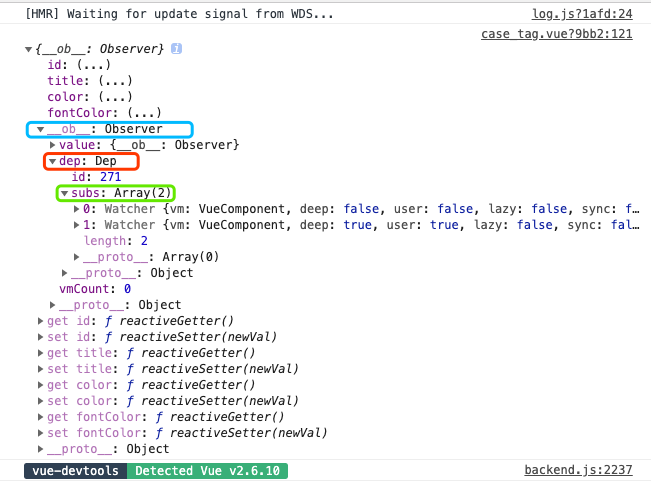

# Vue 的响应式原理

> Vue 的核心思想就是数据驱动，当开发者修改了响应式的数据,vue内部会帮我们更新视图
> Vue.js 实现响应式的核心是利用了Object.defineProperty，IE8 及以下浏览器不能兼容的原因就是不支持这个api。

## 响应式数据

- vue 初始化阶段会调用\_init 方法,其中会有 initState对 data，props，computed，watch 做处理

  ```js
  function initState(vm) {
    var opts = vm.$options;
    // 其中还有 props，computed，watch 等选项处理
    if (opts.data) {
      initData(vm);
    }
  }
  ```

- initData主要对data进行初始化操作，最后通过observe来监测数据的变化

```js
function initData(vm) {
  // data就是我们在vue文件中定义的data
  var data = vm.$options.data;
  // 判断data是否是函数(为什么每个vue实例的data需要是个函数)
  data = typeof data === "function" ? data.call(vm, vm) : data || {};
  // ... 遍历 data 数据对象的key，重名检测，合规检测，访问代理等代码
  const keys = Object.keys(data)
  const props = vm.$options.props
  const methods = vm.$options.methods
  let i = keys.length
  while (i--) {
    const key = keys[i]
    if (process.env.NODE_ENV !== 'production') {
      if (methods && hasOwn(methods, key)) {
        warn(
          `Method "${key}" has already been defined as a data property.`,
          vm
        )
      }
    }
    if (props && hasOwn(props, key)) {
      process.env.NODE_ENV !== 'production' && warn(
        `The data property "${key}" is already declared as a prop. ` +
        `Use prop default value instead.`,
        vm
      )
      // 保留字符
    } else if (!isReserved(key)) {
      proxy(vm, `_data`, key)
    }
  }
  observe(data, true /* asRootData */);
}
```

- observe 方法的作用就是给非 VNode 的对象类型数据添加一个 Observer，如果已经添加过则直接返回，否则实例化一个 Observer 对象实例。

```js
function observe(value) {
  if (!isObject(value) || value instanceof VNode) {
    return;
  }
   let ob: Observer | void
  if (hasOwn(value, '__ob__') && value.__ob__ instanceof Observer) {
    ob = value.__ob__
  }else if{
    ob = new Observer(value);
  }
  return ob;
}
```

- Observer 是一个类，它的作用是给对象的属性添加 getter 和 setter，用于依赖收集和派发更新

```js
export class Observer {
  value: any;
  dep: Dep;
  // 往data中添加__ob__
  constructor(value: any) {
    this.value = value;
    this.dep = new Dep();
    def(value, '__ob__', this)
    if (Array.isArray(value)) {
      this.observeArray(value);
    } else {
      this.walk(value);
    }
  }
    // 如果是Object
    walk(obj: Object) {
      const keys = Object.keys(obj);
      for (let i = 0; i < keys.length; i++) {
      // 遍历对象的数据做劫持
      defineReactive(obj, keys[i]);
      }
    }
    // 如果是Array
    observeArray(items: Array<any>) {
      for (let i = 0, l = items.length; i < l; i++) {
        observe(items[i]);
      }
    }
}
```

- Observer 的构造函数的逻辑主要是：实例化 Dep 对象(管理Watcher)，接着通过执行 def 函数把自身实例添加到数据对象 value 的 __ob__ 属性上，然后对 value 做判断，对于数组会调用 observeArray 遍历数组循环调用observe方法，如果是对象则调用 walk 方法。最终都会执行 defineReactive 方法。

- defineReactive 的核心就是利用 Object.defineProperty 给数据添加了 getter 和 setter，目的就是为了在我们访问数据以及写数据的时候能自动执行一些逻辑：getter 做的事情是依赖收集，setter 做的事情是派发更新，接下来我们就重点对这两个过程分析。

```js
function defineReactive(
  obj: Object,
  key: string,
  val: any,
  customSetter?: ?Function,
  shallow?: boolean) 
{
  // dep 用于中收集所有依赖
  const dep = new Dep();
  const property = Object.getOwnPropertyDescriptor(obj, key)
  if (property && property.configurable === false) {
    return
  }
    // cater for pre-defined getter/setters
  const getter = property && property.get
  const setter = property && property.set
  if ((!getter || setter) && arguments.length === 2) {
    val = obj[key]
  }
  //shallow 只做浅层响应式
  let childOb = !shallow && observe(val)
  Object.defineProperty(obj, key, {
      enumerable: true,
      configurable: true,
      get: function reactiveGetter () {
        const value = getter ? getter.call(obj) : val
        if (Dep.target) {
          dep.depend()
          if (childOb) {
            childOb.dep.depend()
            if (Array.isArray(value)) {
              dependArray(value)
            }
          }
        }
        return value
      },
      set: function reactiveSetter (newVal) {
        const value = getter ? getter.call(obj) : val
        if (newVal === value || (newVal !== newVal && value !== value)) {
          return
        }
        if (setter) {
          setter.call(obj, newVal)
        } else {
          val = newVal
        }
        childOb = !shallow && observe(newVal)
        dep.notify()
      }
    })
}
```

## 依赖收集过程

```html
<template>
  <div>{{message}}</div>
</template>
```

上面这段代码会被 compile 函数解析成

```js
with (this) {
  return _c("div", {}, [message]);
}
```

执行渲染函数，通过 with 讲上下文对象绑定为实例,读取 message 的时候就是访问当前实例的 message;
于是就会触发前面 defineproperty 中的 get 方法，回顾一下get方法：

```js
export function defineReactive (
  obj: Object,
  key: string,
  val: any,
  customSetter?: ?Function,
  shallow?: boolean
) {
  const dep = new Dep()

  const property = Object.getOwnPropertyDescriptor(obj, key)
  if (property && property.configurable === false) {
    return
  }

  // cater for pre-defined getter/setters
  const getter = property && property.get
  const setter = property && property.set
  if ((!getter || setter) && arguments.length === 2) {
    val = obj[key]
  }

  let childOb = !shallow && observe(val)
  Object.defineProperty(obj, key, {
    enumerable: true,
    configurable: true,
    get: function reactiveGetter () {
      const value = getter ? getter.call(obj) : val
      if (Dep.target) {
        dep.depend()
        if (childOb) {
          childOb.dep.depend()
          if (Array.isArray(value)) {
            dependArray(value)
          }
        }
      }
      return value
    },
    // ...
  })
}
```

- defineReactive()方法中new一个 Dep 的实例，当Dep.target存在时通过dep.depend()收集了依赖；接下来我们看构造函数 Dep

<!-- > Dep.target 简单介绍

1. Dep.target 指向的是各种 watcher(页面渲染 watcher,computed,watch 等等)
2. Dep.target 会根据当前解析流程，不停地指向不同的 watcher
   举个栗子:比如当前页面开始渲染时，Dep.target 会提前指向当前页面的 watcher。
   于是页面渲染函数执行，并引用了数据 message 后，message 收集到了 Dep.target，就会收集到当前页面的 watcher
   数据变化时通知相应的 watcher，就可以调用 watcher 去派发更新 -->

```js
export default class Dep {
  static target: ?Watcher;
  id: number;
  subs: Array<Watcher>;

  constructor () {
    // subs中存放watcher(s)
    this.subs = []
  }

  addSub (sub: Watcher) {
    this.subs.push(sub)
  }

  removeSub (sub: Watcher) {
    remove(this.subs, sub)
  }

  depend () {
    if (Dep.target) {
      Dep.target.addDep(this)
    }
  }

  notify () {
    // stabilize the subscriber list first
    const subs = this.subs.slice()
    for (let i = 0, l = subs.length; i < l; i++) {
      subs[i].update()
    }
  }
}
// target作为静态属性指向一个全局唯一 Watcher
Dep.target = null
// 维护一个target栈 用于取出或者恢复watcher
const targetStack = []

export function pushTarget (_target: ?Watcher) {
  if (Dep.target) targetStack.push(Dep.target)
  Dep.target = _target
}

export function popTarget () {
  Dep.target = targetStack.pop()
}
```

我们打印一个data中的对象直观的看一下：



\_\_ob\_\_ 有一个 dep 属性，在上面讲过 dep 正是来管理watchers的

watcher 顾名思义就是监听者，我们看一下他是如何实现的

```js
let uid = 0
export default class Watcher {
  vm: Component;
  expression: string;
  cb: Function;
  id: number;
  deep: boolean;
  user: boolean;
  computed: boolean;
  sync: boolean;
  dirty: boolean;
  active: boolean;
  dep: Dep;
  deps: Array<Dep>;
  newDeps: Array<Dep>;
  depIds: SimpleSet;
  newDepIds: SimpleSet;
  before: ?Function;
  getter: Function;
  value: any;

  constructor (
    vm: Component,
    expOrFn: string | Function,
    cb: Function,
    options?: ?Object,
    isRenderWatcher?: boolean
  ) {
    this.vm = vm
    if (isRenderWatcher) {
      vm._watcher = this
    }
    vm._watchers.push(this)
    // options
    if (options) {
      this.deep = !!options.deep
      this.user = !!options.user
      this.computed = !!options.computed
      this.sync = !!options.sync
      this.before = options.before
    } else {
      this.deep = this.user = this.computed = this.sync = false
    }
    this.cb = cb
    this.id = ++uid // uid for batching
    this.active = true
    this.dirty = this.computed // for computed watchers
    this.deps = []
    this.newDeps = []
    this.depIds = new Set()
    this.newDepIds = new Set()
    this.expression = process.env.NODE_ENV !== 'production'
      ? expOrFn.toString()
      : ''
    // parse expression for getter
    if (typeof expOrFn === 'function') {
      this.getter = expOrFn
    }
    if (this.computed) {
      this.value = undefined
      this.dep = new Dep()
    } else {
      this.value = this.get()
    }
  }

  /**
   * Evaluate the getter, and re-collect dependencies.
   */
  get () {
    pushTarget(this)
    let value
    const vm = this.vm
    try {
      value = this.getter.call(vm, vm)
    } catch (e) {
      if (this.user) {
        handleError(e, vm, `getter for watcher "${this.expression}"`)
      } else {
        throw e
      }
    } finally {
      // "touch" every property so they are all tracked as
      // dependencies for deep watching
      if (this.deep) {
        traverse(value)
      }
      popTarget()
      this.cleanupDeps()
    }
    return value
  }

  /**
   * Add a dependency to this directive.
   */
  addDep (dep: Dep) {
    const id = dep.id
    if (!this.newDepIds.has(id)) {
      this.newDepIds.add(id)
      this.newDeps.push(dep)
      if (!this.depIds.has(id)) {
        dep.addSub(this)
      }
    }
  }

  /**
   * Clean up for dependency collection.
   */
  cleanupDeps () {
    let i = this.deps.length
    while (i--) {
      const dep = this.deps[i]
      if (!this.newDepIds.has(dep.id)) {
        dep.removeSub(this)
      }
    }
    let tmp = this.depIds
    this.depIds = this.newDepIds
    this.newDepIds = tmp
    this.newDepIds.clear()
    tmp = this.deps
    this.deps = this.newDeps
    this.newDeps = tmp
    this.newDeps.length = 0
  }
  // ...
}
```

其中，this.deps 和 this.newDeps 表示 Watcher 实例持有的 Dep 实例的数组；而 this.depIds 和 this.newDepIds 分别代表 this.deps 和 this.newDeps 的 id Set。那么这里为何需要有 2 个 Dep 实例数组呢，稍后我们会解释。

ob 就是 Observe 生成的实例
为什么需要\_\_ob\_\_.dep 来存储依赖?
因为闭包 dep 只存在 defineReactive 中，其他地方访问不到,那么哪些地方需要这个\*\*ob\*\*.dep 呢?

做过 vue 项目的应该都会用到过 this.$set或者this.$del 方法吧,
当我们给某个对象添加响应式的属性的时候会用到,那么他们内部怎么实现的呢

```js
export function set(target, key, val) {
  if (Array.isArray(target) && isValidArrayIndex(key)) {
    target.length = Math.max(target.length, key);
    target.splice(key, 1, val);
    return val;
  }
  if (key in target && !(key in Object.prototype)) {
    target[key] = val;
    return val;
  }
  // 这里就是ob起作用的地方了
  const ob = target.__ob__;
  if (!ob) {
    target[key] = val;
    return val;
  }
  defineReactive(ob.value, key, val);
  ob.dep.notify();
  return val;
}
```

当我们添加或者删除结束的时候就会通过 ob.dep.notify 来通知依赖更新

接下来,我们开始分析数组,其实原理差不多,还是遍历遍历遍历

```js
  // 如果是Array
  observeArray(items: Array<any>) {
    for (let i = 0, l = items.length; i < l; i++) {
      observe(items[i]);
    }
  }
```

数组中也会有\_\_ob\_\_属性,那么数组中的 ob 又在什么地方用到了呢
其实 vue 对数组的变异方法做了一层自己的封装(变异方法就是会修改原数组的方法比如:push)

```js
const arrayProto = Array.prototype;
export const arrayMethods = Object.create(arrayProto);

const methodsToPatch = [
  "push",
  "pop",
  "shift",
  "unshift",
  "splice",
  "sort",
  "reverse",
];

methodsToPatch.forEach(function(method) {
  // cache original method
  const original = arrayProto[method];
  def(arrayMethods, method, function mutator(...args) {
    const result = original.apply(this, args);
    const ob = this.__ob__;
    // notify change
    ob.dep.notify();
    return result;
  });
});
```

用原生的方法处理完数组后依然是通过 ob.dep.notify()通知依赖更新

ob 是什么时候被添加的?往上翻 在 Observe 类的 constructor 中
好了 ob 说完该说核心内容了,vue 是怎么定义 defineProperty.get 的呢(上源码)

```js
export function defineReactive(
  obj: Object,
  key: string,
  val: any,
  customSetter?: ?Function,
  shallow?: boolean
) {
  const dep = new Dep();

  let childOb = !shallow && observe(val);
  Object.defineProperty(obj, key, {
    enumerable: true,
    configurable: true,
    get: function reactiveGetter() {
      const value = val;
      if (Dep.target) {
        dep.depend();
        if (childOb) {
          childOb.dep.depend();
          if (Array.isArray(value)) {
            dependArray(value);
          }
        }
      }
      return value;
    },
    set: function reactiveSetter(newVal) {
      // 往后再说
    },
  });
}
```

1. dep 说过了,就是主要用于存放 watcher 的
2. childOb 是 observe(val)的返回值,当 val 是个基本数据类型时,返回 undefined,否则会不断递归遍历
   在 get 中会判断 childOb 不是基本数据类型时,childOb.dep.depend(),就是 ob 中的 dep 也会收集依赖
3. 当 data 是个数组时会调用 dependArray,目的还是遍历,如果 item 项是对象,那么在 ob.dep 中添加依赖,数组就递归处理

```js
function dependArray(value: Array<any>) {
  for (let e, i = 0, l = value.length; i < l; i++) {
    e = value[i];
    e && e.__ob__ && e.__ob__.dep.depend();
    if (Array.isArray(e)) {
      dependArray(e);
    }
  }
}
```

> get 部分就结束了,依赖收集告一段落,接下来内容很少了,就是依赖更新

## 依赖更新过程

set 函数的源码

```js
set: function reactiveSetter(newVal) {
  const value = val;
  // 如果没变化就return
  if (newVal === value || (newVal !== newVal && value !== value)) {
    return;
  }
  val = newVal;
  // 如果属性已经存在过，设置新值的时候，会重新调用一遍
  childOb = !shallow && observe(newVal);
  // 通知更新依赖
  dep.notify();
}
```

上面对 dep 已经简单介绍过了,其实 dep 并不复杂,是一个 class 类

```js
export default class Dep {
  static target: ?Watcher;
  id: number;
  subs: Array<Watcher>;

  constructor() {
    this.id = uid++;
    this.subs = [];
  }

  addSub(sub: Watcher) {
    this.subs.push(sub);
  }

  removeSub(sub: Watcher) {
    remove(this.subs, sub);
  }

  depend() {
    if (Dep.target) {
      Dep.target.addDep(this);
    }
  }

  notify() {
    const subs = this.subs.slice();
    for (let i = 0, l = subs.length; i < l; i++) {
      subs[i].update();
    }
  }
}

Dep.target = null;
const targetStack = [];

export function pushTarget(target: ?Watcher) {
  targetStack.push(target);
  Dep.target = target;
}

export function popTarget() {
  targetStack.pop();
  Dep.target = targetStack[targetStack.length - 1];
}
```

整个 dep 的作用包含

1. 维护 subs,添加 watcher,删除 watcher
2. 维护一个 targetStack,不同阶段将不同的 watcher 赋值给 Dep.target
3. notify 通知 watcher 执行 update(),页面刷新
