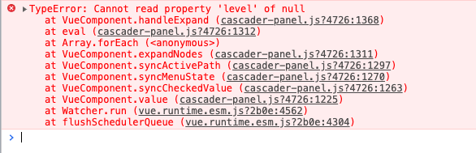
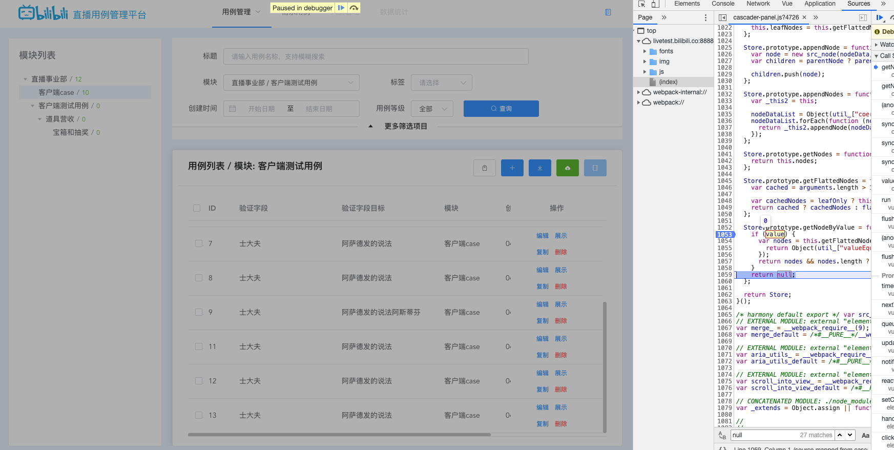
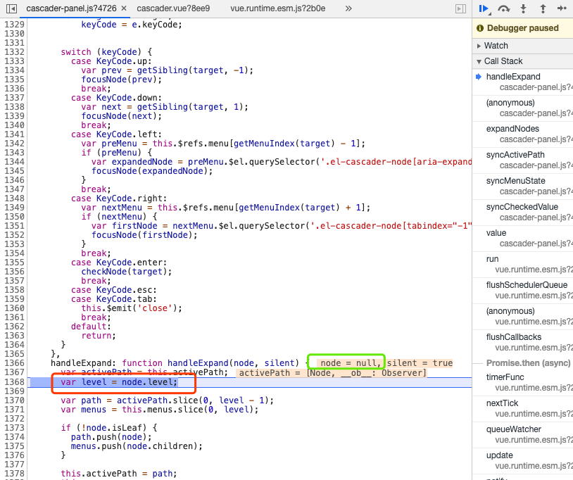

# el-cascader 报错

1. 场景在点击 el-tree 组件时，将对应树的模块 id 传给封装好的 cascader 组件;
2. 在 cascader 中会将 id 转成绑定需要的数组，回显对应的模块
3. 当首次加载页面时没有问题，当点击切换树节点时，控制台报错;("Cannot read property 'level' of null" #18369)

   

4. 在排查问题的时候，一开始以为是 cascader 中的处理函数（根据 id 查对应 id 在树中的位置）的问题;

5. 排查了很久,在控制台中吧对应的点击节点的 id,以及 id 转成的数组,还有上抛给父组件的值都打印了,发现还是没有问题,

6. 并且虽然控制台报错,但是并没有影响页面功能, 在 debugger 下 发现是 cascader-panel 组件里对节点的值有一步这样的操作

在 cascader 从外界传值进来时,第一个节点 也就是顶级节点不能为 0,0 会被隐式转成 false,导致报错;

> 本来准备提 issue 的，后来发现去年就有同样的 issure 在了，而且还没关~~
