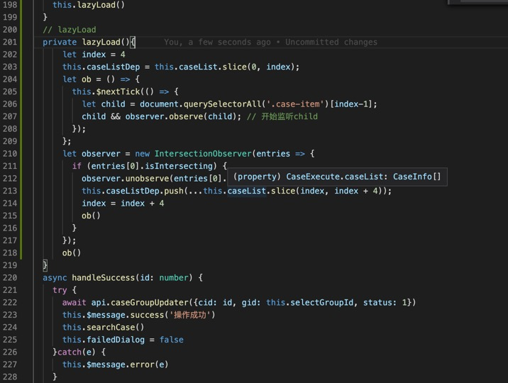

# IntersectionObserver

当后端返回一组没有分页过的庞大数据时,前端如果不作处理,直接丢给浏览渲染的话,会给浏览器造成极大的性能负担,加载时间过长,甚至造成网页未响应

这时候就需要前端按照一定的逻辑做懒加载的处理,所谓懒加载就是数据不会一次性全部加载,当用户滚动页面,数据即将进入视口时才会开始加载代码

思路分析:

1. 将接口的完整数据保存在内存中
2. 给渲染组件绑定的数据设定初始值用于首次渲染(根据一条数据对于视口容器的占比来决定)
3. 对没有进图视口的就近元素监听当用户滚动到被监听的那条数据时,再向绑定的数据中添加指定条数的数据
4. 解除之前元素的绑定,对新的元素绑定,以此循环

交叉观察器: IntersectionObserver，目标元素与视口产生一个交叉区,可以监听元素进入视口。

```js
var io = new IntersectionObserver(callback, option);
// IntersectionObserver是浏览器原生提供的构造函数，接受两个参数：callback是可见性变化时的回调函数，option是配置对象（该参数可选）。
// 构造函数的返回值是一个观察器实例。实例的observe方法可以指定观察哪个 DOM 节点。
// 开始观察
io.observe(document.getElementById('example'));
// 停止观察
io.unobserve(element);
// 关闭观察器
io.disconnect();
```  

## callback 参数

目标元素的可见性变化时，就会调用观察器的回调函数callback。
callback一般会触发两次。一次是目标元素刚刚进入视口（开始可见），另一次是完全离开视口（开始不可见）。

```js
var io = new IntersectionObserver(
  entries => {
    console.log(entries);
  }
);
```

上面代码中，回调函数采用的是箭头函数的写法。callback函数的参数（entries）是一个数组，包含所有被监听的元素的IntersectionObserverEntry对象;

IntersectionObserverEntry对象提供目标元素的信息，一共有六个属性。
每个属性的含义如下。

- time：可见性发生变化的时间，是一个高精度时间戳，单位为毫秒
- target：被观察的目标元素，是一个 DOM 节点对象
- rootBounds：根元素的矩形区域的信息，getBoundingClientRect()方法的返回值，如果没有根元素（即直接相对于视口滚动），则返回null
- boundingClientRect：目标元素的矩形区域的信息
- intersectionRect：目标元素与视口（或根元素）的交叉区域的信息
- intersectionRatio：目标元素的可见比例，即intersectionRect占boundingClientRect的比例，完全可见时为1，完全不可见时小于等于0

## Option 对象

IntersectionObserver构造函数的第二个参数是一个配置对象。它可以设置以下属性。

- threshold 属性
threshold属性决定了什么时候触发回调函数。它是一个数组，每个成员都是一个门槛值，默认为[0]，即交叉比例（intersectionRatio）达到0时触发回调函数。

```js
new IntersectionObserver(
  entries => {/* ... */}, 
  {
    //   用户可以自定义这个数组。比如，[0, 0.5, 1]就表示当目标元素 0%、50%、100% 可见时，会触发回调函数。
    threshold: [0, 0.25, 0.5, 0.75, 1]
  }
);
```

- root 属性

IntersectionObserver API 支持容器内滚动。root属性指定目标元素所在的容器节点（即根元素）。

- rootMargin 属性

```js
var opts = {
  root: document.querySelector('.container'),
  rootMargin: "500px 0px"
};
```

上面代码中，除了root属性，还有rootMargin属性。后者定义根元素的margin，用来扩展或缩小rootBounds这个矩形的大小，从而影响intersectionRect交叉区域的大小。它使用类似CSS的定义方法

场景：

- 当前屏幕最多只能显示3张纵向排列的卡片

- 默认首次从列表中取前四个数据做渲染

- 监听第四张卡片进入观察区，那么向数组中再添加4条数据并监听第八张卡片

- 以此循环，不断地监听和取消监听

  
