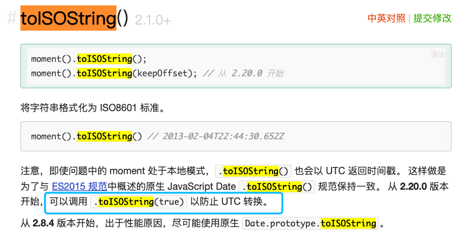

# Mysql的时间类型

- Mysql的日期时间类型主要分为DATE，DATETIME和TIMESTAMP类型

## DATE类型

DATE类型用于具有日期部分但没有时间部分的值。MySQL检索并DATE以'YYYY-MM-DD'格式显示值,支持的范围是从'1000-01-01'到'9999-12-31';

## DATETIME类型

DATETIME类型用于包含日期和时间部分的值。MySQL检索并DATETIME以'YYYY-MM-DD hh:mm:ss'格式显示值,支持的范围是'1000-01-01 00:00:00' 到'9999-12-31 23:59:59';

## TIMESTAMP类型

重点要说的就是这个时间戳格式,之前有需求是对数据分析并用echart展示图表:
我在前端传递的时间范围是用时间戳格式发送的,数据库的存的时间也是TIMESTAMP类型
建表语句如下:

```sql
CREATE TABLE `case_group_rel` (
  `id` int(10) unsigned NOT NULL AUTO_INCREMENT COMMENT '自主主键',
  `ctime` timestamp NOT NULL DEFAULT CURRENT_TIMESTAMP COMMENT '创建时间',
  `mtime` timestamp NOT NULL DEFAULT CURRENT_TIMESTAMP ON UPDATE CURRENT_TIMESTAMP COMMENT '最后修改时间',
  PRIMARY KEY (`id`),
  KEY `ix_mtime` (`mtime`)
) ENGINE=InnoDB DEFAULT CHARSET=utf8 COMMENT "用例组和用例关系";
```

后端接受时间范围的时间戳数组

```js
const startTime = moment(+timeRange[0]).toISOString()
const startTime = moment(+timeRange[1]).toISOString()
createQueryBuilder('case_group_rel').where(`c.mtime BETWEEN '${startTime}' AND '${endTime}'`)
```

上午添加多条用例的后,查询当天0点至24点的用例,返回的数据没什么问题,我以为就大功告成了,下班之前又新增了几条数据 发现新增的数据居然查不到
在控制台打印了数据库中查询到的数据 以及 传递过来的时间戳 发现并没有什么问题,于是面向文档编程,在mysql的官网了解到了原因:

> MySQL将TIMESTAMP值从当前时区转换为UTC以进行存储，然后从UTC转换为当前时区以进行检索。（对于其他类型，例如DATETIME。不会发生这种情况。）默认情况下，每个连接的当前时区是服务器的时间。

也就是说mysql在取值的时候会把时间从UTC格式转成当前时区, moment的toISOString()方法也会以UTC的格式返回时间戳,导致数据不一致



于是在moment官网找到toISOString方法,发现传true可以防止UTC转换,实践之后 问题解决~
