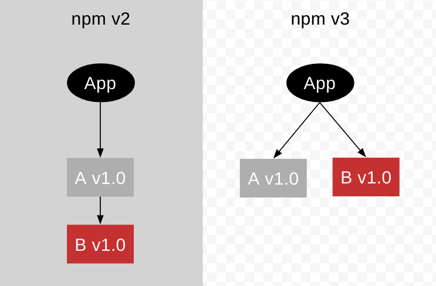
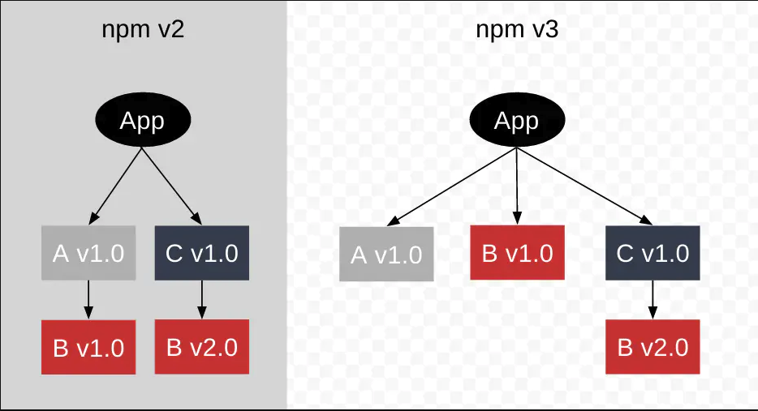
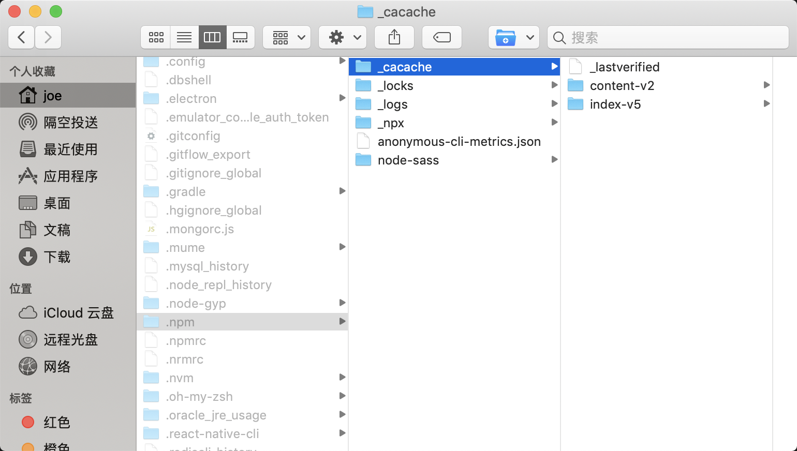

# NPM

npm 作为 JS 包管理工具被前端广泛使用,也是 Node.js 默认的包管理工具:

1. 允许用户从 NPM 服务器下载别人编写的第三方包到本地使用。
2. 允许用户将自己编写的包或命令行程序上传到 NPM 服务器供别人使用。

## install 流程

我们执行 npm install 后，依赖包被安装到了 node_modules 那么具体机制是什么？

1. 发出 npm install 命令
2. npm 向 registry 查询模块压缩包的网址
3. 下载压缩包，存放在~/.npm 目录
4. 解压压缩包到当前项目的 node_modules 目录

### 早期版本

npm 处理依赖的方式是以递归的形式，严格按照 package.json 结构以及子依赖包的 package.json 结构将依赖安装到他们各自的 node_modules 中。直到有子依赖包不在依赖其他模块。

- 优点：node_modules 的结构和 package.json 结构一一对应，层级结构明显，并且保证了每次安装目录结构都是相同的。
- 缺点：但是当依赖的模块非常多的时候，你的 node_modules 将非常庞大，嵌套层级非常之深：在不同层级的依赖中，可能引用了同一个模块，导致大量冗余。

### NPM3 版本

为了改进嵌套过多、套路过深的情况，会将所有依赖放在第二层依赖中（所有依赖只嵌套一次，彼此平行，也就是平铺的结构）将目录层级扁平化 依赖同一个包的不同版本时，还是会嵌套

举个栗子
当项目依赖A模块，但是A依赖于B模块
npm2 会在node_modules 中安装A，将B 安装到 A里面的node_modules, 也就是 A 和 B 是嵌套关系：
npm3 会将模块A 和模块B 安装到同一 node_modules 目录下，二者是同级的；

  
  
如果项目又引入了另一个模块C，C依赖于另一个版本的B，那么NPM3会将另一个版本的B嵌套在C中

  

### NPM5 版本

主要变化：

1. 默认安装后会生成 package-lock.json 锁定版本，保证安装的依赖的确定性

2. --save 变成了默认参数，执行 install 依赖包时默认安装到 dependencies

tip：如果已经有 package-lock，在 package 中手动添加依赖再执行 install 时，该包并不会被安装到 node_modules，package-lock 也不会更新

#### 安装流程

安装流程根据lock文件采取不同的安装流程

1. 无 lock 文件：

    根据 package.json 构建依赖树，构建规则：

    - 构建依赖树时，不管其是直接依赖还是子依赖的依赖，优先将其放置在 node_modules 根目录。
    - 当遇到相同模块时，判断已放置在依赖树的模块版本是否符合新模块的版本范围，如果符合则跳过，不符合则在当前模块的 node_modules 下放置该模块。
    - 这一步只是确定逻辑上的依赖树，并非真正的安装，后面会根据这个依赖结构去下载或拿到缓存中的依赖包

    在缓存中依次查找依赖树中的每个包

    - 不存在缓存：从 npm 远程仓库下载包，校验包的完整性后复制到 npm 缓存目录，将下载的包按照依赖结构解压到 node_modules
    - 存在缓存：将缓存按照依赖结构解压到 node_modules，生成相应的 lock 文件

2. 有 lock 文件：

    检查 package.json 中的依赖版本是否和 package-lock.json 中的依赖有冲突。
    如果没有冲突，直接跳过获取包信息、构建依赖树过程，开始在缓存中查找包信息，后续过程相同

## 缓存

开头说到了npm install除了将依赖包安装在node_modules 目录下外，还会在本地的缓存目录缓存一份。

  

在_cacache文件中包含了三个文件

1. _lastverified ：记录上一次修改的时间戳
2. 在index-v5 ：用于存储tar包的 hash
3. content-v2 ：用于存储tar包的缓存

> npm 在执行安装时，根据 package-lock.json 中存储的 integrity、version、name 生成一个唯一的 key 对应到 index-v5 目录下的缓存记录，从而找到 tar包的 hash，然后根据 hash 再去找缓存的 tar包直接使用。

常用的操作缓存的命令：

npm cache clean：删除缓存目录下的所有数据，为了保证缓存数据的完整性，需要加上 --force 参数。
npm cache verify：验证缓存数据的有效性和完整性，清理垃圾数据。

基于缓存数据，npm 提供了离线安装模式，分别有以下几种：

- --prefer-offline：优先使用缓存数据，如果没有匹配的缓存数据，则从远程仓库下载。
- --prefer-online：优先使用网络数据，如果网络数据请求失败，再去请求缓存数据，这种模式可以及时获取最新的模块。
- --offline：不请求网络，直接使用缓存数据，一旦缓存数据不存在，则安装失败。

## 部署优化

在生产阶段部署代码时，npm安装会占用很多时间，怎么尽量缩减install的速度呢？

1. 指定访问速度快的registry（官方的仓库在国外，访问速度延迟大）
2. --production，只安装生产环境必要的包（注意：需要严格区分 开发环境/生产环境 的依赖）
3. 使用 npm ci 代替 npm i，结合 CI 的缓存功能，充分利用 npm cache既提升速度又保障应用安全性

> npm ci 是NPM 5.7.0 引入的安装依赖的方式，用于自动化环境（例如测试平台，持续集成和部署），或者在任何情况下都要确保干净安装依赖项。通过跳过某些面向用户的功能，它可以比常规的npm安装快得多。它也比常规安装更加严格，这可以帮助捕获大多数npm用户增量安装的本地环境引起的错误或不一致。

- 项目里面必须存在 package-lock.json 或 npm-shrinkwrap.json.
- 如果 package lock 里面依赖和 package.json 不一致， npm ci 会报错并且退出， 而不是更新 package lock 文件
- npm ci 只能一次性安装整个工程的依赖， 不能使用这个命令单独添加依赖
- 如果 node_modules 文件夹存在， 它会在安装依赖之前删除这个文件夹
- 它不会改变 package.json 或者任何 package-locks
